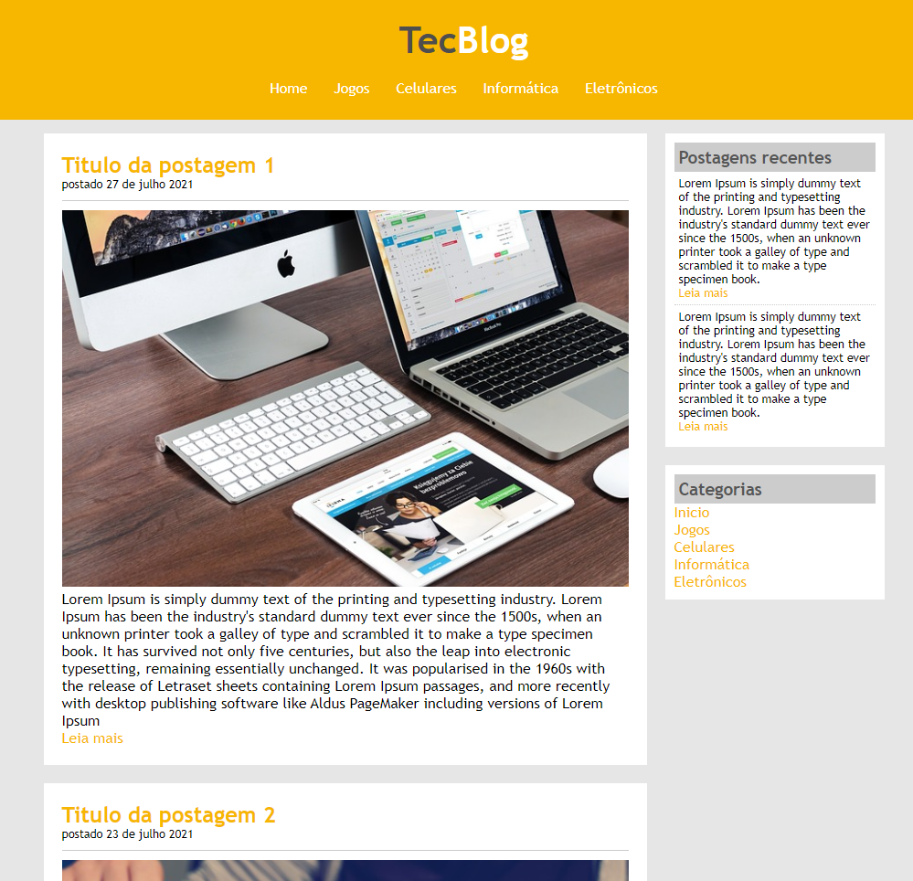

# HTML-5-CSS3
Projetos desenvolvidos em HTML5 + CSS3 durante o curso, o código é de autoria do professor embora eu tenha reproduzido durante o curso!

# Projetos HTML5

Os projetos disponibilizados nestes diretórios, foram todos desenvolvidos, juntamente com os professores responsáveis pelo curso.
No decorrer do curso foram vistos os seguintes conceitos:

## HTML5: 
Cabeçalhos, listas, imagens, links, tabelas, formulários, hear, nav, footer, article, section aside.

## CSS3 Intermediário:
Seletores, div & span, cores, modelo caixa, elementos flutuantes, posicionamento, formatando links.

## CSS3 avançado:
Herança, especifidade, barra navegação vertical e horizontal, abas, layouts líquidos, largura fixa, parallax, fontes customizadas.

## Recursos especiais:
Normalize css, cantos arredondados, degradês, sombras, animações, transições, flexbox.
 

# HTML5

## Projeto UNES (Página institucional de uma universidade)
 

- Prévia do projeto:

 
 

# CSS3
 

## Projeto Anna Bella (Página web pessoal)
 

- Prévia do projeto:

 
 

## Projeto TecBlog (Blog de tecnologia)
 

- Prévia do projeto:

 
 

# CSS3 Intermediário & avançado
 

## Projeto Notícias da Cidade (Portal de notícias)
 

- Prévia do projeto:

 
 

## Projeto Chalé Hotel (Página publicitária)
 

- Prévia do projeto:

 
 

# HTML5 e CSS3 - Recursos especiais
 

## Projeto Museu Nacional
 

- Prévia do projeto:

 
 

## Projeto Efeito Parallax
 

- Prévia do projeto:

 
 

- Os códigos são de autoria de Jamilton Damasceno
-  
- E foram reproduzidos por Fernando Piattelli.
